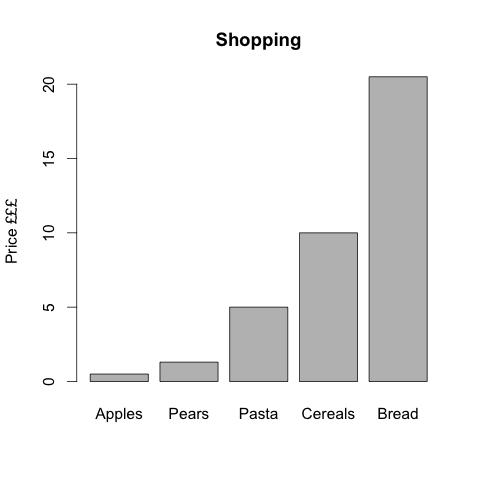

<!-- vim-markdown-toc GFM -->

* [Assign numbers to variables](#assign-numbers-to-variables)
* [Lists of numbers (vectors, in fact)](#lists-of-numbers-vectors-in-fact)
* [Tables](#tables)
* [Make a graph](#make-a-graph)

<!-- vim-markdown-toc -->


Assign numbers to variables
---------------------------

Use the `<-` to assign a number or a list of numbers or anything to a variable
with a handy name. For example:

```
cupquake <- 10
radiojh <- 20
```

Now, `cupquake + radiojh` is the same as `10 + 20`, try it:

```
cupquake + radiojh
```

Why assignment to variables matters? Because in this way you can put a lot of
stuff in a short name easy. See below.

Lists of numbers (vectors, in fact)
-----------------------------------

To make a list of numbers use the `c(...)` syntax. If the list is quite long,
like a long shopping list, you put it in a variable and work with that variable
instead. `price` may be a list of prices of things we bought:

```
price <- c(0.5, 1.3, 5, 10, 20.5)
```

Let's do some arithmetic:

* How much did we spend in total (*sum*)?

```
sum(price)
```

* How much would we spend if we bought two of each thing?

```
sum(price) * 2
```

* How much would each thing cost if it was half the price

```
price / 2
```

Tables
------

Say we want to give a name to each thing in `price`. We can make a table with a
column for the name and a column for the price.

First, make list of names, then make a table with `data.frame`. Note that thing
names have quotes: 

```
thing <- c('Apples', 'Pears', 'Pasta', 'Cereals', 'Bread')

buy <- data.frame(thing, price)

buy
    thing price
1  Apples   0.5
2   Pears   1.3
3   Pasta   5.0
4 Cereals  10.0
5   Bread  20.5
```

Make a graph
------------

Let's see how much each thing costs in graph, which is easier to grasp than a
table:

```
barplot(price, names.arg= thing, beside= TRUE, ylab= 'Price £££', main= 'Shopping')
```

<!--
png('figures/shopping.png')
par(cex= 1.3)
barplot(price, names.arg= thing, beside= TRUE, ylab= 'Price £££', main= 'Shopping')
dev.off()
-->



