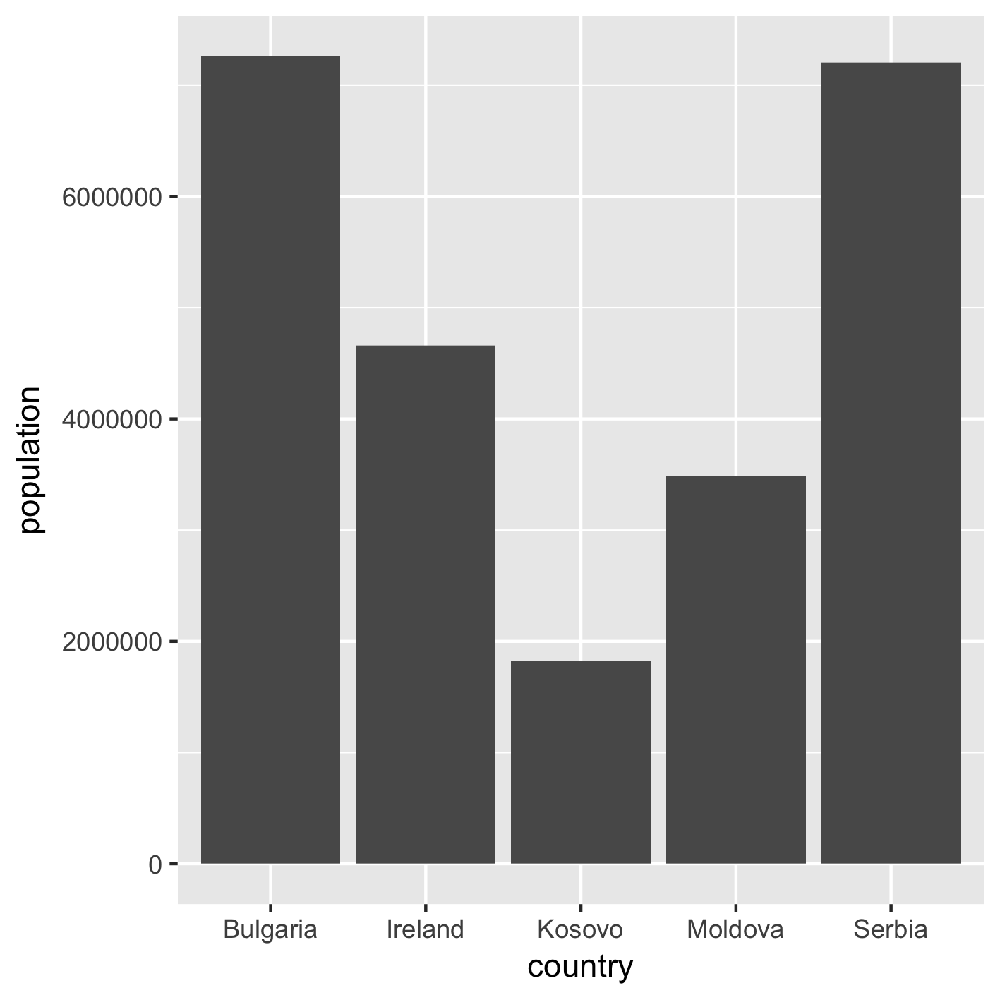

Slice & dice  tables
====================

Start R. With `library(...)` we make use of additional tools.

```
R
library(data.table)
library(ggplot2)
```

Read a table of European countries and show the first 10 lines:

```
eu<- fread('https://raw.githubusercontent.com/dariober/sympy-books/master/begin-r/data/eu_countries.txt')

eu[1:10, ]
```

**Note** the use of square brackets `[]` access and slice the table.

Show countries where data was collected in year 2013. 

**NOTE** the sign `==` meaning *equal to*

```
eu[year == 2013]
```

* Show countries with population *less* than 1,000,000 people.

**NOTE** the `<` sign meaning *less than*

```
eu[population < 1000000]
```

* Show countries where population is *less than* 1,000,000 AND *greater than* 100,000 people.

**NOTE** the `>` sign meaning *greater than* together with the `&` meaning AND.

```
eu[population < 1000000 & population > 100000]
```

* Order countries by year and show only the top 10:

```
eu[order(country)][1:10, ]
```

You can make a copy of the sliced table and use it later. For example, get the
countries where population was estimated in the year 2012 AND population
between 1 and 10 million people. Put them in table called `eu2012`:

```
eu2012 <- eu[year == 2012 & population < 10000000 & population > 1000000]
```

To list only some countries, use the `%in%` operator followed by the list of countries you want to show:

```
eu[country %in% c('Italy', 'Poland', 'United Kingdom')]
```

Make a graph
------------

Now, use the table *eu2012* to make a graph showing the population of these countries:

```
ggplot(data= eu2012, aes(country, population)) + geom_col()
```

<!--
ggsave('figures/countries.png', height= 12, width= 12, units= 'cm')
-->



Some summary numbers of the european countries  
----------------------------------------------

* Number of countries (that is, number of rows in the *eu* table)

```
nrow(eu)
```

* Total number of people. **NOTE** the use of `$` to get
only one column as list.

```
sum(eu$population)
```

* Country with most people. First, get the biggest number in the *population*
  column, then ask *which country has this many people?*:

```
most<- max(eu$population)
eu[population == most]
```


